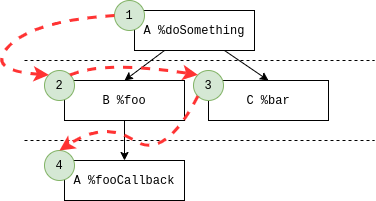
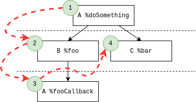
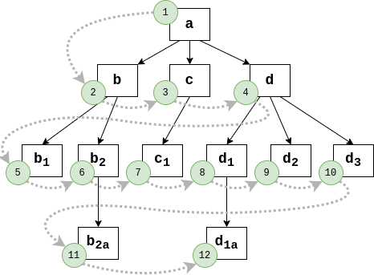
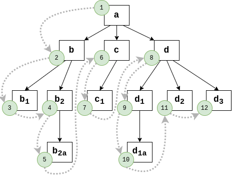

# Inter-contract invocations

In this guide, we will look into contract interactions on Tezos. We will provide examples of how one contract can invoke and create other contracts on the same chain. We will also describe the execution model Tezos contracts live in and see how it is different from a more conventional "direct calls" model.

## Internal operations

When you make a transaction to a contract, this contract may, in turn, emit other operations. These operations are called "internal". There are three kinds of internal operations:
1. Transaction – an operation that transfers value and, if the callee is an originated contract, executes the code of the callee.
2. Origination – creates a new smart contract.
3. Delegation – sets a delegate for the current contract.

We will mainly focus on internal _transactions,_ as this is the most common type of internal operations. We will also show how contracts can originate other contracts.

## A note on complexity

Usually, you don't want to have overly-complex contract interactions when you develop your Tezos contracts. There are several reasons for this:
1. Transactions between contracts are expensive. Tezos bakers need to fetch the callee from the context (this is how internal blockchain storage is called in Tezos), deserialize and typecheck it, then perform the requested operation and store the result. Among these actions, code execution is the cheapest one in terms of gas.
2. Transactions between contracts are hard and error-prone. When you split your business logic across several contracts, you need to think of how these contracts interact. This may cause unforeseen vulnerabilities if you don't give it enough attention.
3. Tezos most probably has other means to achieve what you want. Lambdas make it possible to alter the behavior of the contract after origination, new cryptographic primitives get introduced via protocol upgrades, separation of concerns can be achieved by splitting your business logic into LIGO modules that will eventually get compiled into a single contract, etc.

However, there are legit reasons for using internal operations, including the following:
1. You communicate with an external entity, e.g., transfer a third-party FA2 token.
2. You develop a universal caller contract, e.g., a multisig contract.
3. You implement a standard that explicitly forbids you to extend the functionality.

## Internal transactions in LIGO
The simplest example of an internal transaction is sending Tez to a contract. Note that in Tezos, implicit accounts owned by people holding private keys are contracts as well. Implicit accounts have no code and accept _unit_ as the parameter. Let's look at the following code snippet:
```
type parameter = address
type storage = unit

let main (destination_addr, _ : parameter * storage) =
  let maybe_contract : unit contract option =
    Tezos.get_contract_opt addr in
  let destination_contract =
    match maybe_contract with
    | Some contract -> contract
    | None -> (failwith "Contract does not exist" : unit contract) in
  let op =
    Tezos.transaction () amount destination_contract
  (op, ())
```

It accepts a destination address as the parameter. Then we need to check whether the address points to a contract that accepts a unit. We do this with `Tezos.get_contract_opt`. This function returns `Some value` if the contract exists and the parameter type is correct. Otherwise, it returns `None`. In case it's `None`, we fail with an error, otherwise we use `Tezos.transaction` to forge the internal transaction to the destination contract.

Let's also examine a contract that stores the address of another contract and passes an argument to it. Here is how this "proxy" can look like:
```
type parameter = int
type storage = address

let get_contract (addr : address) =
  match (Tezos.get_contract_opt addr : int contract option) with
  | Some contract -> contract
  | None -> (failwith "Callee does not exist" : int contract)

let main (param, callee_addr : parameter * storage) =
  let callee : int contract = get_contract (callee_addr) in
  let op =
    Tezos.transaction param 0tez callee in
  ([op], calleeAddr)
```

To call a contract, we need to add a type annotation `: int contract option` for `Tezos.get_contract_opt`. LIGO knows that `Tezos.get_contract_opt` returns a `contract option` but at the time of type inference it does not know that the callee accepts an `int`. In this case, we expect the callee to accept an `int`. Such a callee can be implemented like this:
```
let main (param, storage : int * int) =
  ([] : operation list), storage + param
```

But what if we want to make a transaction to a contract but don't know the full type of its parameter? For example, we may know that some contract accepts `Add 5` as its parameter, but we don't know what other entrypoints are there.

```
type parameter =
  | Set of int
  | Add of int
  | Subtract of int
  | Multiply of int
  | Reset

let main (param, storage : parameter * int) =
  let nop : operation list = [] in
  match param with
  | Set n -> nop, n
  | Add n -> nop, storage + n
  | Subtract n -> nop, storage - n
  | Multiply n -> nop, storage * n
  | Reset -> nop, 0
```

LIGO compiler generates the following Michelson type for the parameter of this contract:

```
(or (or (or (int %add)
            (int %multiply))
        (or (unit %reset)
            (int %set)))
    (int %subtract));
```

The type got transformed to an annotated tree of Michelson union types (denoted with `or typeA typeB`). The annotations (`%add`, `%multiply`, etc.) here represent _entrypoints_ – a construct Tezos has special support for.

In Tezos, we are not required to provide the _full_ type of the contract parameter if we specify an entrypoint. In this case, we just need to know the type of the _entrypoint_ parameter – in case of `%add`, it's an `int` – not the full type.

To specify an entrypoint, we can use `Tezos.get_entrypoint_opt` instead of `Tezos.get_contract_opt`. It accepts an extra argument with an entrypoint name:

```
(* EntrypointProxy.mligo *)

type parameter = int
type storage = address

let get_add_entrypoint (addr : address) =
  match (Tezos.get_entrypoint_opt "%add" addr : int contract option) with
  | Some contract -> contract
  | None -> (failwith "The entrypoint does not exist" : int contract)

let main (param, callee_addr : parameter * storage) =
  let add : int contract = get_add_entrypoint (callee_addr) in
  let op =
    Tezos.transaction param 0tez add in
  ([op], calleeAddr)
```

To get the entrypoint names from parameter constructors, you should make the first letters lowercase and prepend a percent sign: `Add` -> `%add`, `CallThePolice` -> `%callThePolice`. LIGO does this transformation internally when it compiles your code into Michelson.

Entrypoints are especially useful for standardization. For example, FA2 token standard does not force the contracts to have some specific parameter type – it would be too limiting for tokens that want to have additional functionality. Instead, the standard requires the tokens to have some predefined set of entrypoints, and other contracts may expect these entrypoints to be present in FA2-compliant tokens.

## Interoperability and standards compliance

There are several high-level languages for Tezos, and you shouldn't expect that all the contracts you interact with are written in LIGO.

Internally, Tezos stores and operates on contracts in Michelson. Currently, Michelson does not support record and variant types of arbitrary length natively. It only has `pair a b` and `or a b`, each containing just _two_ type parameters.

LIGO automatically converts a complex type `type t = Hello | L | I | G | O` into an annotated left-balanced tree with items sorted alphabetically: `(or (or (or (unit %g) (unit %hello)) (or (unit %i) (unit %l))) (unit %o))`. LIGO applies the same transformation to record types: 
```
type t = {
  hello : int;
  l : nat;
  i : bytes;
  g : string;
  o : address;
}

(pair (pair (pair (string %g)
                  (int %hello))
            (pair (bytes %i)
                  (nat %l)))
      (address %o))
```

However, other languages may use a different representation. For example, they can use a right-hand comb:
```
(pair (int %hello)
      (pair (nat %l)
            (pair (bytes %i)
                  (pair (string %g)
                        (address %o)))))
```

It is not a problem for top-level parameter types: we can expect the callers to specify an entrypoint. But if we pass structures and values of variant types as entrypoint arguments, we need to make sure their internal representation is the same.

If you interact with other contracts, or expect other contracts to interact with your contract, we strongly advise you to consider using special types and annotations described in the [Interop](https://ligolang.org/docs/advanced/interop) section of the documentation.

## Execution order

When you emit an internal operation, Tezos puts it into the _internal operations queue._
Let's see what this queue looks like when you have one contract that emits two internal operations:

| Current call | Queue before | Queue after |
|--------------|--------------|-------------|
| `A %doSomething` | [] | [`B %foo`, `C %bar`] |
| `B %foo` | [`C %bar`] | [`C %bar`] |
| `C %bar` | [] | [] |

Now let's say that `B %foo` emits another operation, e.g. it calls back to `A %fooCallback`. Tezos will put this internal operation to the end of the queue:

| Current call | Queue before | Queue after |
|--------------|--------------|-------------|
| `A %doSomething` | [] | [`B %foo`, `C %bar`] |
| `B %foo` | [`C %bar`] | [`C %bar`, `A %fooCallback`] |
| `C %bar` | [`A %fooCallback`] | [`A %fooCallback`] |
| `A %fooCallback` | [] | [] |

Notice how this callback gets executed _after_ `C %bar`. If we construct a tree of internal operations, such queuing would be analogous to a breadth-first search (BFS):



This BFS execution order is very different from Ethereum's direct synchronous method calls, which are analogous to depth-first search. Here is how the transactions would be ordered in Ethereum:



Here's a more complex scenario featuring a graph of 12 different operations. We omit the contract and entrypoint names and use lowercase latin letters and numbers to identify operations.
1. BFS order (Tezos):



2. DFS order (Ethereum):




In practice, you should always bear in mind that the internal operations are queued and not executed immediately. It means that:

* There is no guarantee that there would be no operations in between the current transaction and an emitted operation (e.g., on the BFS graph above, `b2` emits `b2a`, but 4 operations are executed in between these two).
* If you emit a sequence of operations, they will be executed one after the other, with no operations in between. In other words, it's guaranteed that `b`, `c`, and `d`, emitted by `a`, will not be interleaved by other operations. This property holds true even if `a` is not the root of the call graph.
* If you emit a sequence of operations, the whole sequence will be executed _before_ any possible internal operations that may arise as a result of any of these operations.

## Returning values

When trying to port an existing distributed application to Tezos, you may want to _read_ the storage of another contract or call some entrypoint to get a computed value. In Tezos, entrypoints can only update storage and emit other operations.

In theory, one can use a callback – the callee could emit an operation back to the caller with the computed value. However, this pattern is often insecure:
* You should somehow make sure that the response matches the request. Due to the breadth-first order of execution, you can't assume that there have been no other requests in between.
* Some contracts use `Tezos.sender` value for authorization. If a third-party contract can make a contract emit an operation, the dependent contracts may no longer be sure that the operation coming from the sender is indeed _authorized_ by the sender.

Let's look at a simple access control contract with a "view" entrypoint:

```
type parameter =
  Call of (unit -> operation)
| IsWhitelisted of (address * (bool contract))

type storage = {
  senders_whitelist : address set
}

let main (p, s : parameter * storage) =
  let op = match p with
  | Call op ->
    if Set.mem Tezos.sender s.senders_whitelist
    then op ()
    else (failwith "Sender is not whitelisted" : operation)
  | IsWhitelisted arg ->
    let addr, callback_contract = arg in
    let whitelisted = Set.mem addr s.senders_whitelist in
    Tezos.transaction whitelisted 0tez callback_contract
  in [op], s
```

Now imagine we want to control a contract with the following interface (we omit the full code of the contract for clarity; you can find it in the [examples folder](./examples)):
```
type parameter =
  Transfer of address * address * nat
| SetPaused of bool

type storage = {
  ledger : (address, nat) big_map;
  owner : address;
  paused : bool
}

let transfer (src, dst, amount_, storage : address * address * nat * storage) : storage
  = (* ... *)

let main (p, s : parameter * storage) =
  ([] : operation list),
  (match p with
  | Transfer arg ->
    if s.paused
    then
      (failwith "The contract is paused" : storage)
    else
      let src, dst, amount_ = arg in
      transfer (src, dst, amount_, s)

  | SetPaused paused ->
    if Tezos.sender <> s.owner
    then
      (failwith "Access denied" : storage)
    else
      { s with paused = paused })
```

You may notice that we can abuse the `IsWhitelisted` entrypoint to pause and unpause the token, even if we are not among the whitelisted senders. Try it out:

`tezos-client call "$ACCESS_CONTROLLER" from "$EVA" --entrypoint "%isWhitelisted" --arg "Pair ($WHITELISTED_ADDRESS, $TARGET %setPaused)"`

## Contract factories

So far, we have covered only one type of operation – transaction. But we can _originate_ contracts from LIGO a well! There is a special instruction `Tezos.create_contract`. It accepts four arguments:
1. Contract code. Note that the code must be an inline function that does not use any existing bindings.
2. Optional delegate.
3. The amount of Tez to send to the contract upon origination.
4. The initial storage value.

For example, we can create a new counter contract with
```
Tezos.create_contract
  (fun (p, s : int * int) -> ([] : operation list), p + s)
  (None : key_hash option)
  0tez
  1
```

`Tezos.create_contract` returns a pair of _origination operation_ and the _address_ of the new contract. Note that, at this stage, the contract has not been originated yet! That's why you cannot forge a transaction to the newly-created contract: `Tezos.get_{contract, entrypoint}_opt` would fail if called before the origination operation has been processed.

`CreateAndCall` contract in the examples folder shows how we can call the created contract with a callback mechanism:

```
// Here we create two operations: the one that will originate
// the contract, and an operation to self, that will continue
// the execution after the contract is originated.
let create_and_call (storage : address list) =
  let create_op, addr =
    Tezos.create_contract
      (fun (p, s : int * int) -> ([] : operation list), p + s)
      (None : key_hash option)
      0tez
      1 in
  let call_op =
    Tezos.transaction
      (addr, 41)
      0tez
      (Tezos.self "%callback" : (address * int) contract)
  in [create_op; call_op], addr :: storage
```

By the time `%callback` is called, the `create_op` would be completed. Thus, the factory `%callback` can forge yet another operation to call the default entrypoint of the new contract:

| Current call | Queue before | Queue after |
|--------------|--------------|-------------|
| `A %createAndCall` | [] | [Originate `B`, `A %callback`] |
| Originate `B` | [`A %callback`] | [`A %callback`] |
| `A %callback` | [] | [`B %default`] |
| `B %default`  | [] | [] |

If you use this pattern, please mind the execution model and check whether the guarantees it provides are enough for security of your application.
